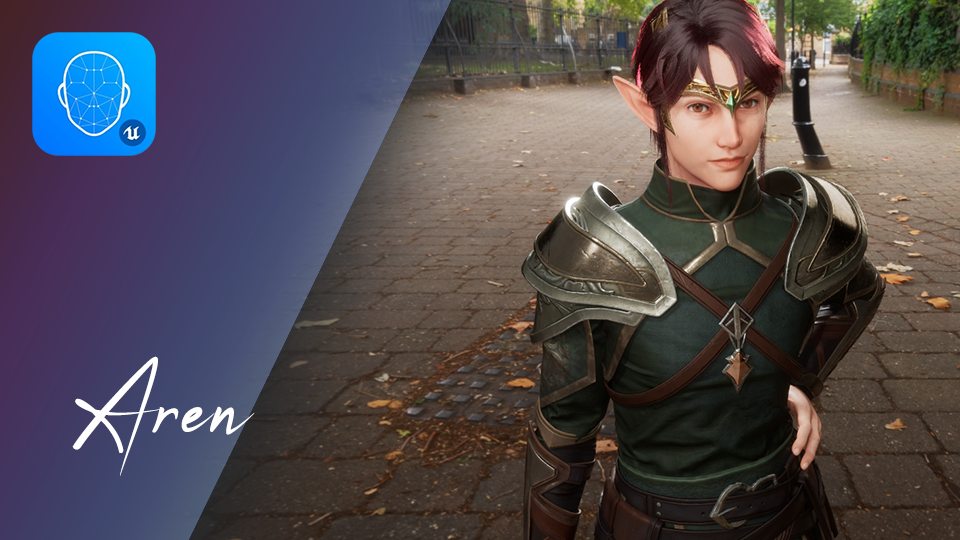
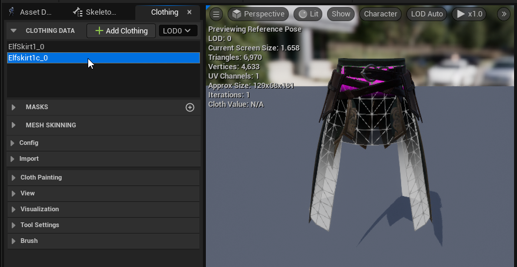
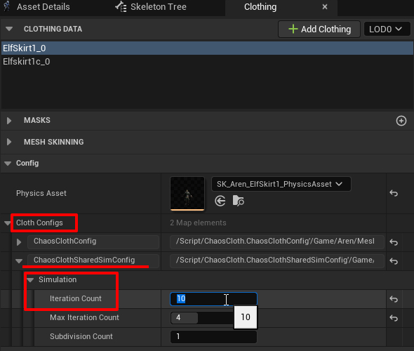

Aren Documentation
====================

{}
Documentation is still working in progress (currently is having a very low priority but I will try to spent more time on this)...
{}

{}

 

 

{}

 

Clothing
--------------------

### Elf Skirt 1

I am trying out two different clothing proxies for elf skirt 1. I think the full cylinder one might looks a bit more stable but feel free to switch between the two to see which one works best for you.

{}
In Unreal Engine 5, there are options to improve the quality of the cloth simulation:

{}
