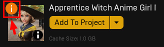

# Characters Common Sections

## Common Features

   <!-- 

      
FEATURES

      

      

   
 -->
   

      
Morph Targets

      
Yes

      
~55 <a href="https://developer.apple.com/documentation/arkit/arfaceanchor/blendshapelocation/">Apple Blendshapes</a>

   

   

      
Full Body Under Clothes

      
Yes

      

   

   

      
Source Fbx

      
Included

      
You can find the source fbx files in the    folder

   

   

      
Change Material Color

      
Yes

      
RGB Mask Textures provided for making color changes

   

   

      
Skeleton

      
Based on UE4 Mannequin

      
* No Additional Bones Added

   

   

      
Textures

      
PBR (Physically Based Rendering)

      
* Metallic Roughness Workflow

   

   

      
Animations

      

      

   

   

      
Animations

      
Demo Animations

      

      Retargeted UE4 Mannequin Default Animations, a few of Paragon Animations and a few of Echo's Animation
      

   

 

## Character's Skeleton

My current characters (Meryl, Shenya, Charles, Lia and Aren) follows the same skeleton as UE4's Mannequin. They have the same bone names and skeleton structure, however the skeleton **proportion** of my characters are different from the UE Mannequins:

For example, Meryl's skeleton has all the same bones but the joints position are different. As for joint orientation (ie. rotations), I try my best to match the original bone orientation of the UE4 mannequin above but because they are hand aligned (I use my eyeball to judge), the alignments are not machine-accurate.

My current characters are having all these bones below (and no additional bones added):

{}

{}

The character's skeleton also has a different scale than UE4's Mannequin, for example, Meryl has a smaller size:

{}
Please consider the points above before buying and using it in your project. Due to the size differences, and my characters having different bones position and rotations from the UE mannequins, you might face some challenges when trying to retarget animations. Most often during retargeting, you will face problems for animations that are holding weapons, or where in the animations, the hands or feet need to stay locked to the the ground or some other objects.

You can also check out my characters' ALS and Lyra sections of their videos to see how the retargeting might looks. I am using the "Assign Skeleton" method for ALS while using the "Retarget Pose from Mesh" (using IKRetargeter asset) method for Lyra.

By the way, I created some videos that might be helpful to you when you need to some retargeting.
{}

{}





{}

 

## Character's Updates

If you see this " ***i*** " icon over my characters, it means I have updated something to the character asset. You can always check out each character's **Change Log** first to see what has changed, before you click on the update button. Because sometimes, it might just be some updates that wouldn't benefit your project (so you can skip this update) or sometimes it's a very big change that you might want to consider backing up your existing character asset first.