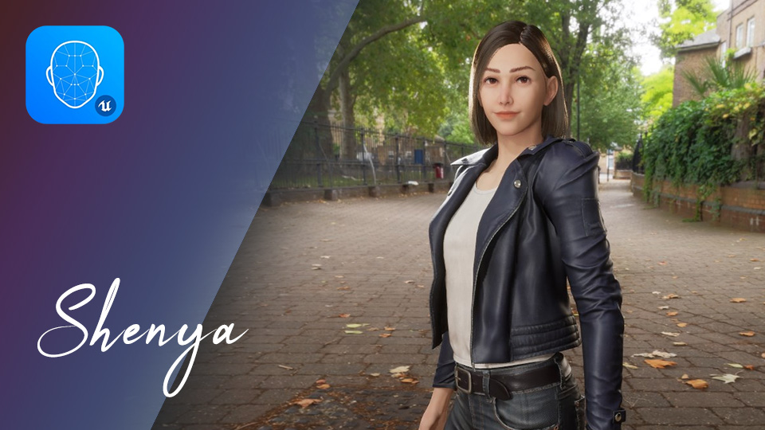
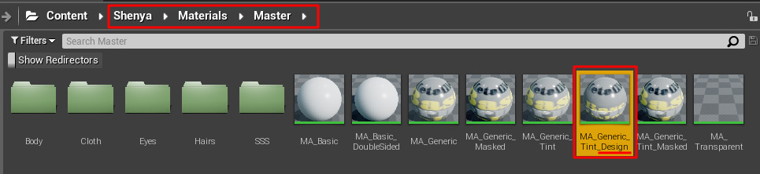
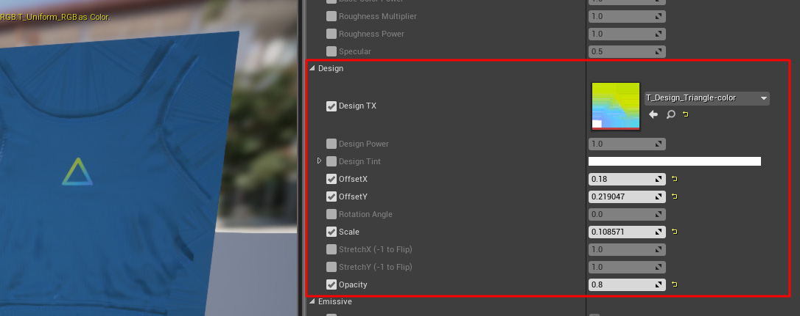
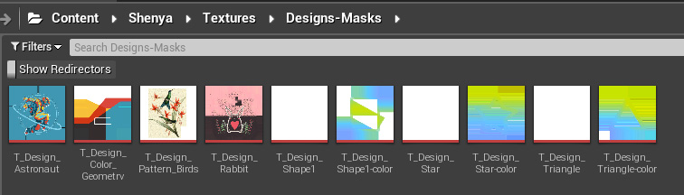

Shenya Documentation
====================

{}
Documentation is still working in progress (currently is having a very low priority but I will try to spent more time on this)...
{}

{}
The [Old Shenya documentation at readthedocs.org](https://unreal-shenya.readthedocs.io/en/latest/updates-log.html) is outdated and will eventually be removed.
{}

---

{}

 

 

{}

 

Materials
--------------------

### Design Material

{}

or click here [UE Casual Female - Shenya Asset Overview](https://www.youtube.com/watch?v=nUcbepp6P_k&t=318s)


{}

The master materials with "_Design" in their names allows you to overlay a design image on top of base color texture.

These are the parameters, you can Move/Rotate/Flip/Stretch the image and also change the brightness (Parameter: Design Power), color tint and opacity of the design image.

Shenya comes with some designs that you can use, but of course you can import your own design. All the provided images contains alpha/transparency.

#### Credits to the Design Textures

Please see [Image Credits](./image-credits.md).

\* The Shapes Designs are created by me in Inkscape.

